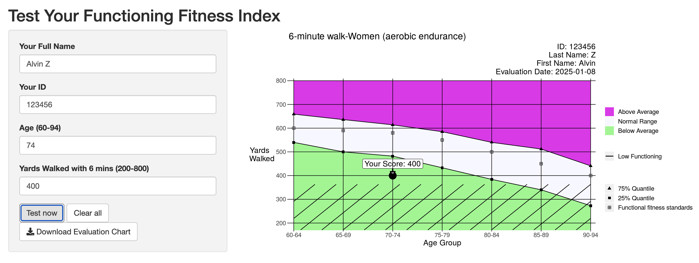

# Visualization by Shiny 

This depository is used for the updated codes for the simple application created by Shiny.

This is a simple web application for "Test Your Functioning Fitness Index". The testing graphs are downloadable, with a normal letter size.

This website is published on my personal shinyapps.io applications [Test Your Functioning Fitness](https://statscomputing.shinyapps.io/Visualization_result/).

## Fitness Assessment

The fitness assessment in which you participated provide data about the physical abilities
that older adults (i.e., > 60 yrs of age) need to maintain mobility and physical independence.

This website support input of full name, Name, age, gender, record and test measures for each metric. The assessment results are shown after clicking 'Test now'. It also support the download of the full assessment report in pdf with corresponding name and ID, e.g.,   "ID_12345_Name_Alvin Z.pdf".

## Reference
Rikli, R.E., & Jones, C.J. (2012). Development and validation of criterion-referenced clinically relevant fitness standards for maintaining physical independence in later years. The Gerontologist, 0,1-13. [doi:10.1093/geront/gns071](https://academic.oup.com/gerontologist/article-abstract/53/2/255/560735?redirectedFrom=fulltext&login=false).
